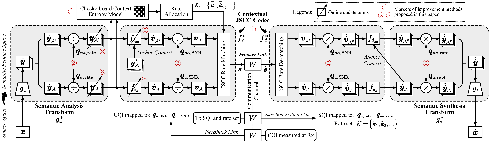
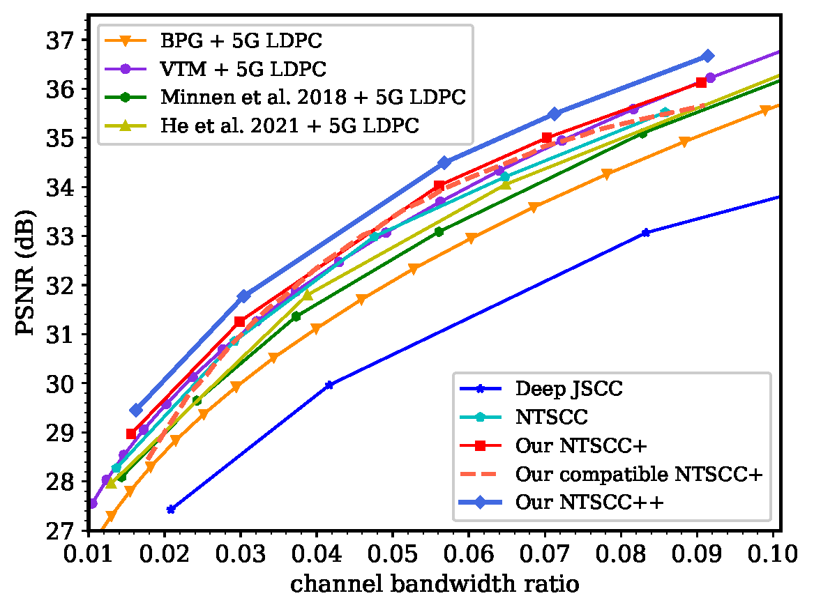
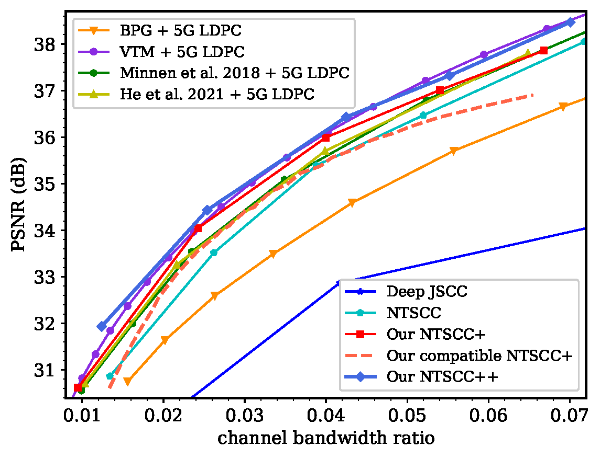

# Improved Nonlinear Transform Source-Channel Coding to Catalyze Semantic Communications [[pdf]](https://arxiv.org/pdf/2303.14637)

This is the repository of the
paper "[Improved Nonlinear Transform Source-Channel Coding to Catalyze Semantic Communications](https://arxiv.org/abs/2303.14637)".

## Pipeline



## Evaluation on [Kodak](http://r0k.us/graphics/kodak/) Dataset and [CLIC 2021 testset](http://clic.compression.cc/2021/)




## Requirements

Clone the repo and create a conda environment (we use PyTorch 1.9, CUDA 11.1).

The dependencies
includes [CompressAI](https://github.com/InterDigitalInc/CompressAI), [Natten](https://www.shi-labs.com/natten/),
and [timm](https://huggingface.co/docs/timm/installation).


## Trained Models

Download the pre-trained models
from [Google Drive](https://drive.google.com/)
or [Baidu Netdisk](https://pan.baidu.com/s/19yVfIq-IccBgYHH2ImUM1A) (提取码: deye).

Note: We reorganize code and the performances are slightly different from the paper's.

## Evaluate

**Evaluate:**

```bash
# Kodak
python main.py --gpu-id 0 --test-only --eval-dataset-path /path/to/kodak --eval-dataset-name kodak --pretrained /path/to/checkpoint
```

## TODO:
Release the code and weights for online reference (NTSCC++) and compatible NTSCC++. 

## Acknowledgement

Codebase
from [CompressAI](https://github.com/InterDigitalInc/CompressAI), [TinyLIC](https://github.com/lumingzzz/TinyLIC),
and [Swin Transformer](https://github.com/microsoft/Swin-Transformer)

## Citation

If you find this code useful for your research, please cite our paper

```
@inproceedings{
      wang2023improved,
      title={Improved Nonlinear Transform Source-Channel Coding to Catalyze Semantic Communications},
      author={Sixian Wang and Jincheng Dai and Xiaoqi Qin and Zhongwei Si and Kai Niu and Ping Zhang},
      year={2023},
      booktitle={IEEE Journal of Selected Topics in Signal Processing, early access},
}
```